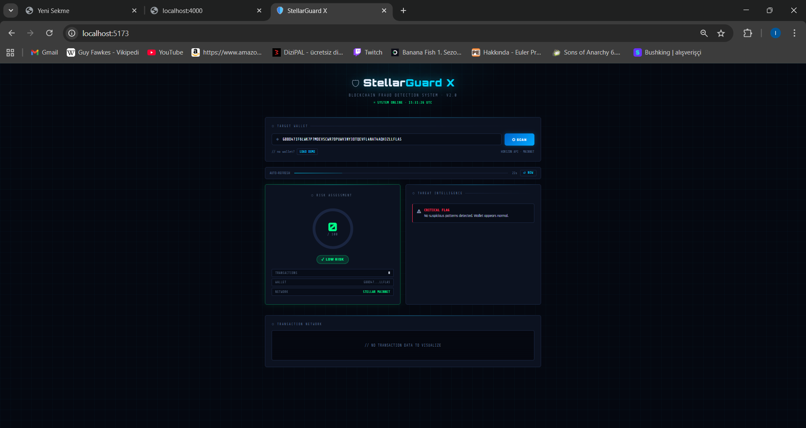
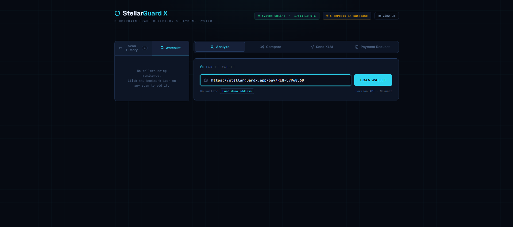
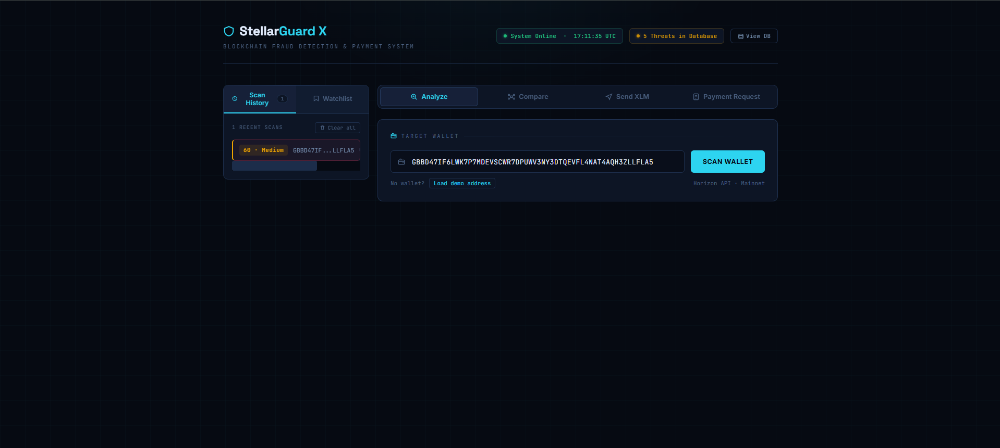
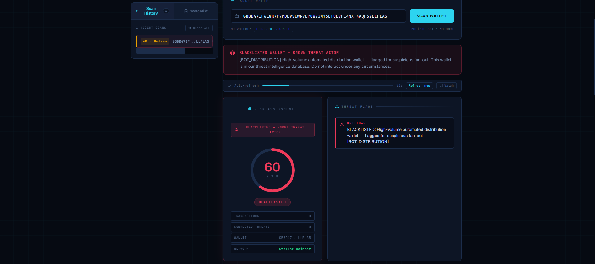

# 🛡️ StellarGuard X

> Real-time fraud detection and risk analysis for Stellar wallets — built for the **Stellar Zonguldak Workshop Challenge**.

---

## 🚀 Live Smart Contract (Testnet)


**Contract ID:** `CB7K36JL25A4VO67X6FLIKCCGA2YJWI35CXZZGZ6FBV3UOQX6LLSPN5Q`

**Deployer Address:** `GD4DKHCWBTQM6TMZHZT75WGC5OWMSKQETGUL42AEJGNBUYYTRZBJWEPT`

**Network:** Stellar Testnet

**Explorer Links:**
- 🔗 [View Contract on Stellar Expert](https://stellar.expert/explorer/testnet/contract/CB7K36JL25A4VO67X6FLIKCCGA2YJWI35CXZZGZ6FBV3UOQX6LLSPN5Q)
- 🔗 [View on Stellar Lab](https://lab.stellar.org/r/testnet/contract/CB7K36JL25A4VO67X6FLIKCCGA2YJWI35CXZZGZ6FBV3UOQX6LLSPN5Q)

**Deployment Transactions:**
- Upload WASM: [3db825142ba902724ef213b5a07415a9ff58e07531ad53b3afb830ff382c812e](https://stellar.expert/explorer/testnet/tx/3db825142ba902724ef213b5a07415a9ff58e07531ad53b3afb830ff382c812e)
- Deploy Contract: [a466532d5334a7b79e76b79d4b1e1be3a9b584f1344047f8ffa0f20556a073df](https://stellar.expert/explorer/testnet/tx/a466532d5334a7b79e76b79d4b1e1be3a9b584f1344047f8ffa0f20556a073df)

---

## Description

StellarGuard X fetches a wallet's payment history from the Stellar Horizon API, runs it through a multi-rule risk engine, and presents the results as a clean dashboard with a risk score, plain-language explanations, and an interactive transaction network graph.

---

## Features

- 🔍 **Wallet Analysis** — paste any Stellar public key and get instant results
- 📊 **Risk Score (0–100)** — color-coded Low / Medium / High rating
- 🧠 **Risk Reasons** — human-readable explanation of every flag triggered
- 🕸️ **Transaction Network Graph** — SVG node-link diagram of wallet relationships
- 🚨 **High-Risk Alert Banner** — prominent warning for dangerous wallets
- ⚡ **Loading & Error States** — graceful handling of bad addresses and network issues

---

## Tech Stack

| Layer       | Technology                        |
|-------------|-----------------------------------|
| Frontend    | React 18 + Vite                   |
| Backend     | Node.js + Express                 |
| Smart Contract | Soroban (Rust)                 |
| Blockchain  | Stellar Network                   |
| API         | Stellar Horizon + Soroban RPC     |
| Graph       | Custom SVG (no extra library)     |
| Styling     | Plain CSS dark theme              |

---

## Project Structure

```
stellar-guard-x/
├── contracts/                 # Soroban smart contracts
│   ├── src/
│   │   └── lib.rs            # Subscription contract (Rust)
│   ├── Cargo.toml
│   ├── deploy.sh             # Deployment script
│   └── README.md
├── backend/
│   ├── server.js              # Express app + /analyze endpoint
│   ├── services/
│   │   ├── horizon.js         # Horizon API client
│   │   ├── stellarPayment.js  # XLM payment logic
│   │   └── contractSubscription.js # Contract integration
│   └── utils/
│       └── riskEngine.js      # Risk scoring logic
├── frontend/
│   ├── index.html
│   ├── vite.config.js
│   └── src/
│       ├── main.jsx
│       ├── App.jsx
│       ├── api.js             # Backend API wrapper
│       ├── styles.css
│       └── components/
│           ├── WalletInput.jsx
│           ├── RiskScore.jsx
│           ├── RiskReasons.jsx
│           └── WalletGraph.jsx
├── DEPLOYMENT.md              # Contract deployment guide
└── README.md
```

---

## Setup & Running Locally

### Prerequisites

- Node.js ≥ 18
- npm ≥ 9

### 1. Clone / enter the project

```bash
cd stellar-guard-x
```

### 2. Install & start the backend

```bash
cd backend
npm install
npm start
# → http://localhost:4000
```

### 3. Install & start the frontend (new terminal)

```bash
cd frontend
npm install
npm run dev
# → http://localhost:5173
```

Open **http://localhost:5173** in your browser.

---

## API Usage

### `GET /analyze?wallet=ADDRESS`

Analyzes a Stellar wallet and returns a risk report.

**Example request:**
```
GET http://localhost:4000/analyze?wallet=GBBD47IF6LWK7P7MDEVSCWR7DPUWV3NY3DTQEVFL4NAT4AQH3ZLLFLA5
```

**Example response:**
```json
{
  "wallet": "GBBD47IF6LWK7P7MDEVSCWR7DPUWV3NY3DTQEVFL4NAT4AQH3ZLLFLA5",
  "transaction_count": 42,
  "risk_score": 25,
  "risk_level": "Low",
  "reasons": [
    "No suspicious patterns detected. Wallet appears normal."
  ],
  "graph": {
    "nodes": [{ "id": "GBBD...", "label": "GBBD…LA5", "isTarget": true }],
    "links": [{ "source": "GBBD...", "target": "GABC...", "amount": "10.0", "asset": "XLM" }]
  }
}
```

**Risk levels:**
| Score | Level  |
|-------|--------|
| 0–30  | Low    |
| 31–70 | Medium |
| 71–100| High   |

---

## Risk Rules

| Rule | Trigger | Score Added |
|------|---------|-------------|
| High volume | > 50 transactions | +20 |
| Micro-transactions | > 20 payments under 1 XLM | +30 |
| Low diversity | < 5 unique destinations | +25 |
| Rapid fan-out | > 30 unique destinations | +15 |
| Receive-only | No outgoing payments (> 5 tx) | +10 |

---

## Demo Wallet

```
GBBD47IF6LWK7P7MDEVSCWR7DPUWV3NY3DTQEVFL4NAT4AQH3ZLLFLA5
```

Click **"Load demo address"** in the UI to auto-fill it.

---

## Screenshots
## Screenshots

### 🏠 Dashboard


---

### 🚨 High Risk Alert


---

### 🕸️ Transaction Graph


---

### 💸 Payment System


## Smart Contract

StellarGuard X includes a **deployed Soroban smart contract** for on-chain subscription management:

**Contract ID:** `CB7K36JL25A4VO67X6FLIKCCGA2YJWI35CXZZGZ6FBV3UOQX6LLSPN5Q`

### Features:
- ✅ **Subscribe**: 30-day subscription with 100 wallet scans
- ✅ **Check Status**: Verify active subscriptions on-chain
- ✅ **Consume Scans**: Decrement scan credits automatically
- ✅ **Renew**: Extend subscription and add more scans
- ✅ **Persistent Storage**: All data stored on Stellar blockchain

### Documentation:
- 📋 [Contract Information & Transactions](./CONTRACT_INFO.md)
- 🚀 [Deployment Guide](./DEPLOYMENT.md)
- ⚡ [Quick Start](./contracts/QUICKSTART.md)

---

- [ ] Multi-hop graph traversal (analyze connected wallets)
- [ ] Asset diversity analysis (XLM vs custom tokens)
- [ ] Historical risk trend chart
- [ ] Wallet watchlist / saved reports
- [ ] On-chain memo text analysis for scam keywords
- [ ] Export report as PDF
- [x] Soroban smart contract for subscriptions

---

## License

MIT — built for the Stellar Zonguldak Workshop Challenge 🚀


LOOM LİNK: https://www.loom.com/share/47f852cf773b4ea3849dbba89ae829ed


